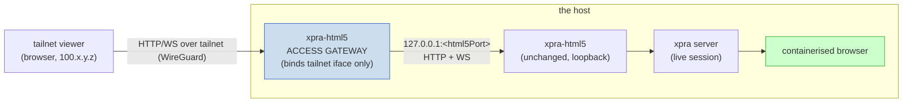
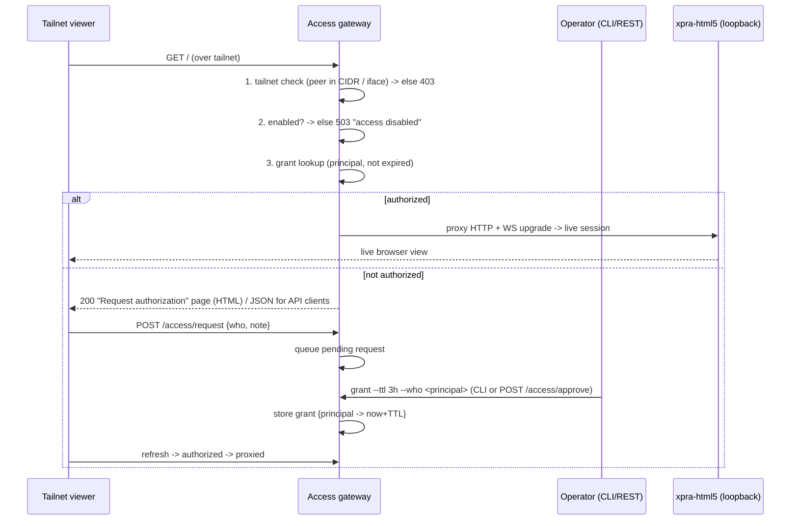

# xpra-html5 Tailnet Remote-Access Gateway

> Refined from `webctl:mgr`'s source brief (2026-06-24,
> `webctl-mgr/docs/design/2026-06-24-xpra-html5-tailnet-access-gateway.md`),
> inspired by the internal `virtual-pdf-printer-pipeline` (vpdf-printer) tailnet
> auth-gateway. Service-agnostic; the controlled site/platform is never named.
> **Status: review** — the source brief's 5 "open decisions for Greg" are
> resolved here to the manager's recommended defaults (§10); Greg may override.

## 1. Principle

A `*-webctl` tool running in **docker+xpra** execution-mode already hosts an
`xpra` server in its container, with the **xpra-html5** web client published to
`127.0.0.1:<html5Port>` (loopback only — never on a LAN). An operator wants to
**attach to that live session from another machine on the same tailnet, on
demand, time-boxed, without restarting anything**.

The principle: **proxy the loopback html5, never touch the session.** xpra is
inherently multi-client, so a second viewer attaches to a *live* session without
disturbing it — the only thing missing is a *safe remote path* to a loopback-only
port. A small **access gateway** in front of the unchanged html5 port supplies
that path, and — because the gateway is separate from the session — enabling or
disabling remote access becomes a toggle of *the gateway*, not a restart of the
browser.

This is an **execution-mode capability** of the docker+xpra mode, so it belongs
in base as a shared standard every docker+xpra consumer inherits (and the
new-tool scaffold ships pre-wired, **off by default**).

## 2. Grounded current state

* The docker+xpra driver (`chromium-docker-xpra.js`) publishes, on the host:
  CDP at `127.0.0.1:<port>`, xpra-TCP at `<xpraTcpPort>`, and **xpra-html5 at
  `<xpraHtml5Port>` = `xpraTcpPort + 1`** — all bound to `127.0.0.1` only.
* The driver already exposes `<xpraHtml5Port>` (and the slug) via `inspect()` —
  a known seam the gateway reads to learn `slug → html5Port`.
* xpra multi-client means **attach-without-restart is already true at the xpra
  layer**; this design only adds the guarded remote path.

> **P1 grounding correction (2026-06-24, live stack).** Against a *running*
> docker+xpra session the xpra-html5 client + its WS are served on the **xpra TCP
> port (`<xpraTcpPort>`)** — e.g. `127.0.0.1:14327` returned the
> `xpra websockets client` page — while `<xpraTcpPort>+1` (the `XPRA_HTML5_BIND`
> port, 14328) **did not answer HTTP**. So the gateway's `upstreamPort` must be
> the port that actually serves html5, which is `<xpraTcpPort>`, NOT `+1`. P5
> wiring (driver `inspect()` → gateway upstream) must target the serving port;
> the `xpraHtml5Port = +1` assumption above is the *configured* bind, not where
> xpra serves the client in this image build. (Seam surprise, dockerfilesDir/
> version-class — flagged to the manager.) P1 takes `upstreamPort` explicitly, so
> this does not block P1; it constrains P5 wiring + the driver `inspect()` contract.



## 3. Architecture — `createXpraHtml5Gateway(C, opts)`

A new base module `lib/browser-location/xpra-html5-gateway.js`, factory-shaped
per the sm2t seam, consumed via the standard re-export shim. It is a
**WebSocket-aware reverse proxy + auth portal**.

**Zero-dependency (base-substrate invariant, `sb7q`/`v8p3`):** implementable with
Node stdlib only — `http` for the portal/auth/REST, and on the HTTP `'upgrade'`
event a **raw `net.connect` to `127.0.0.1:<html5Port>` + bidirectional socket
pump**. We *proxy* WS frames, we do not parse them, so **no `ws` dependency** is
needed (~150 lines). This is a deliberate divergence from the vpdf-printer
FastAPI/Python stack — base stays zero-dep ESM, no toolchain imposed on consumers.

### 3.1 Request lifecycle



## 4. Per-requirement design

### 4.1 Tailnet-only — single code path, principal-keyed (decision 1: LOCKED)

Bind the gateway to the **tailnet interface IP** (the host's `100.x` address,
discoverable via `tailscale ip -4` / `tailscale status --json`), never `0.0.0.0`,
and enforce a **CIDR allowlist** (default `100.64.0.0/10`, Tailscale CGNAT /
RFC 6598) **before auth**. Off-tailnet ⇒ `403 network not allowed`.

The grant store is keyed by an **opaque `principal` string**, resolved by a
swappable **principal resolver**:

* **default resolver** — `tailscale whois <peerIP:port>` → tailnet user/node
  (per-**user** grants + attributable audit). When `whois` is unavailable, the
  resolver **falls back to the peer IP** as the principal.

This makes the minimal (IP/CIDR) and enhanced (per-user identity) tiers **the
same code with the resolver swapped — no rework**. TLS via `tailscale serve` is
deferred (decision 5); tailnet traffic is already WireGuard-encrypted, so the
gateway is safe on a trusted tailnet without it.

### 4.2 Time-limited authorization — 3h default (decision 2: LOCKED)

* **Persistent JSON grant store**: `{requests:{}, grants:{principal:{ttl,
  grantedBy, grantedAt, expiresAt}}}`, atomic write (temp + rename), **lazy
  expiry pruning on read**.
* Stored in a **gitignored state dir** — `<cacheRoot>/state/xpra-access.json`
  (or `$XDG_STATE_HOME`). It is session-grade access state — same secret-class as
  cookies → **never committed** (SECRET-FREE invariant; `.gitignore` template `f868`).
* **Flexible TTL parser**: `15min|1h|3h|12h|forever|<n>{min,h,d}` → absolute
  `expiresAt`. **Default TTL = 3h** (Greg; the prior art defaulted 12h).
* **Optional sliding-window renew-on-activity** flag so an active viewer is not
  evicted mid-session (the prior art lacked this).

### 4.3 CLI + REST grant/revoke

REST (the only pre-auth-open path is `POST /access/request`):

| Endpoint | Auth | Purpose |
|---|---|---|
| `POST /access/request {who?, note?}` | open (tailnet peer) | queue a pending request |
| `GET  /access/requests` | operator | list pending |
| `POST /access/approve {principal, ttl}` | operator | grant (default 3h) |
| `POST /access/reject {principal}` / `revoke {principal}` | operator | deny / end |
| `GET  /access/grants` | operator | active grants + `remainingSeconds` (pruned) |
| `POST /access/enable` / `disable` | operator | the dynamic toggle (§4.5) |

CLI is a thin wrapper over REST (headless + scripted approval both work):

```
webctl xpra-access status                        # enabled? grants? pending?
webctl xpra-access enable  [--slug <slug>] [--hard]
webctl xpra-access disable [--slug <slug>] [--hard]
webctl xpra-access grant   --who <principal> --ttl 3h
webctl xpra-access revoke  --who <principal>
webctl xpra-access requests                      # pending approval queue
```

REST/CLI emit `lszd` JSONL envelopes for machine consumption.

### 4.4 Request-authorization page

An unauthorized **browser** gets a `200` HTML page (a small request form: who /
note / submit), NOT a JSON error; an unauthorized **API/CLI** client gets JSON
(content-negotiated on `Accept`) so it can script. Submitting POSTs
`/access/request`; the operator sees it in `xpra-access requests` and approves;
the viewer refreshes into the live session. Optional shared **pre-token**
(`XPRA_ACCESS_TRUST_TOKEN`) suppresses drive-by requests.

### 4.5 Enable/disable — soft default + `--hard` (decision 3: LOCKED)

`enabled` is a field in the gateway state plus the `/access/{enable,disable}`
endpoints/CLI. **Disabled ⇒ the gateway refuses all proxying (`503`) while the
xpra session and the running browser are completely untouched.**

* **soft (default)** — the gateway process stays up and flips the flag (instant,
  revocable, no listener churn).
* **hard (`--hard`)** — stop the gateway process / close the tailnet listener
  entirely (no network surface at all). For paranoia / long idle periods.

## 5. Multi-session topology — per-host slug multiplexer (decision 4: LOCKED)

**One gateway per host, multiplexing by slug.** `https://<host>.<tailnet>/<slug>/`
routes to that slug's loopback html5 port; the gateway holds a `slug → html5Port`
map it learns from each driver's `inspect()`. One tailnet listener, one grant
store, one approval queue, one place to authorize. (The alternative — one gateway
per session, N listeners + N queues — is simpler code but multiplies surface; not
the base default.)

## 6. Safety / secret-free

* The gateway exposes **only the visual html5** (the rendered browser view) —
  **never CDP** (which can drive/exfiltrate the session) and never the
  profile/cookies. CDP stays `127.0.0.1`.
* The grant/request store is **access state → gitignored**, never committed
  (SECRET-FREE invariant; same class as cookies, `f868`).
* Tailnet-only + TTL + default-deny + per-principal audit ⇒ least-privilege,
  time-boxed, attributable (`dip7` defense-in-depth).
* No TLS needed on a trusted tailnet (WireGuard); `tailscale serve` TLS is the
  deferred enhancement (decision 5) for shared/again-shared tailnets.
* Blocked-state interplay: remote-view is an OBSERVE path; it does not bypass the
  blocked-state handling (`k7m2`) — a blocked session is still blocked, just
  visible to an authorized operator who can intervene.

## 7. Constants seam (sm2t) + run-mode integration

* `createXpraHtml5Gateway(C, opts)` — base-owned shared-identical bits; per-repo
  bits injected via `client-config.constants` (`sm2t`): e.g.
  `XPRA_ACCESS_DEFAULT_TTL` (`'3h'`), the CGNAT range, the state-file path
  fragment, the CLI verb namespace. `opts` injects the principal resolver, an
  fs/clock seam for tests, and the `slug → html5Port` lookup (from the driver's
  `inspect()`, mirroring the `chromium-docker-xpra` deps contract).
* It becomes an **optional, default-off `remote-view` capability of the
  docker+xpra mode** in the run-mode contract (`8hw5`), so every current and
  future docker+xpra consumer inherits identical remote-attach semantics, and the
  new-tool scaffold ships it pre-wired (off).

## 8. How this improves on the prior art (vpdf-printer)

| Concern | prior art | this design |
|---------|-----------|-------------|
| Dynamic enable/disable | needs container restart | gateway toggle, session untouched |
| Identity granularity | IP-only | per-**principal** via `tailscale whois` (resolver) |
| Audit trail | approver = IP only | per-principal grant log |
| TLS | none | tailnet WireGuard; optional `tailscale serve` (deferred) |
| Default TTL | 12h | **3h** (Greg) |
| Sliding window | none | optional renew-on-activity |
| Stack | FastAPI/Python | **zero-dep Node stdlib** (base substrate) |

Adopted as-is from the prior art: CIDR-before-auth, persistent JSON TTL grants,
lazy expiry, HTML-form-for-browsers / JSON-for-API, embedded (no separate proxy
service), localhost-always-trusted.

## 9. Phased plan (one-small-refactoring-at-a-time)

* **P1** — `createXpraHtml5Gateway(C, opts)`: HTTP+WS reverse proxy to loopback
  html5, bound to the tailnet iface, CIDR allowlist, `enabled` flag. Prove
  attach-without-restart against a live docker+xpra session.
* **P2** — grant store (persistent JSON, 3h default, lazy expiry) + REST
  (`request/requests/approve/reject/revoke/grants/enable/disable`) + the
  request-authorization HTML page.
* **P3** — `webctl xpra-access` CLI over REST (`lszd` JSONL).
* **P4** — principal resolver (`tailscale whois`) + audit log (+ optional
  `tailscale serve` TLS, the deferred decision 5).
* **P5** — fold into the run-mode/docker+xpra mode contract + the new-tool
  scaffold (off by default), per-repo constants via the sm2t seam.

Each phase is independently testable; un-shippable bits → `FUTURE_WORK/`.
Design-doc-first: no lib lands before this doc is reviewed-accepted.

## 10. Decisions (manager defaults LOCKED; Greg may override)

| # | Decision | Resolution |
|---|----------|-----------|
| 1 | Identity tier | **principal-keyed resolver**: `whois` when available, else IP — Tier A and Tier B are the same code |
| 2 | Default TTL | **3h** |
| 3 | Toggle default | **soft** (flag flip) + `--hard` option |
| 4 | Topology | **per-host slug multiplexer** |
| 5 | `tailscale serve` TLS | **deferred** to P4 (tailnet WireGuard suffices meanwhile) |
